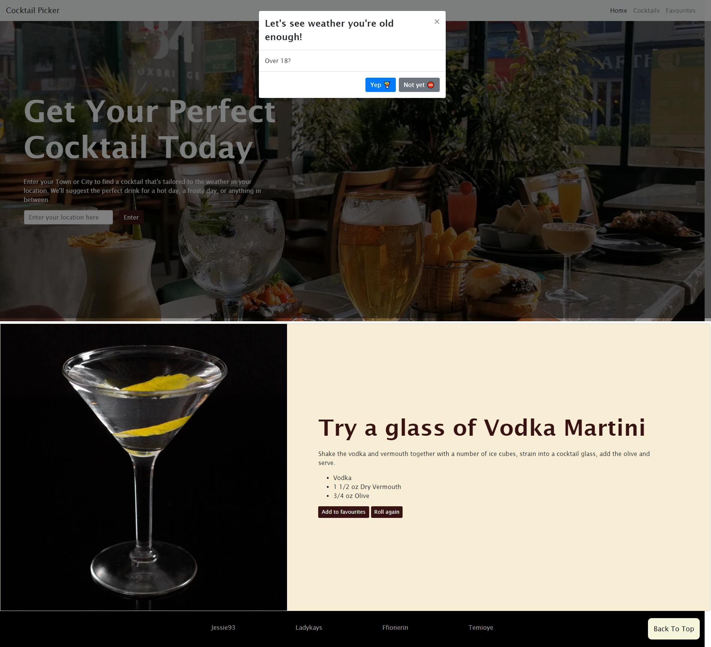
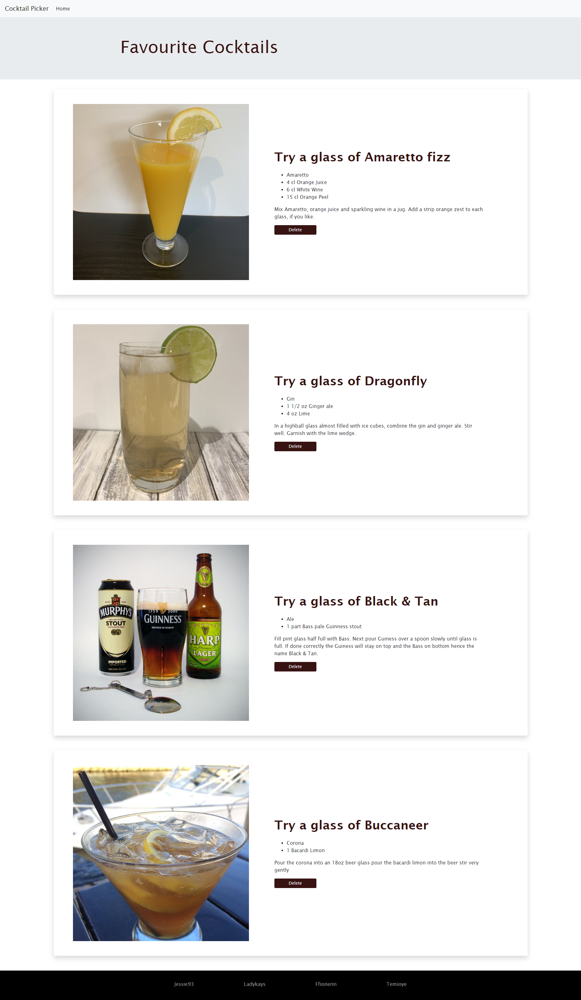

# Weather Pourcast

## Description
We've created a website that provides users with a unique experience by offering cocktail recommendations based on the temperature at their location. After a user enters their town or city, we'll suggest the perfect drink. Features include:
* Modal to check whether users are 18 on page load
* A random cocktail suggested on page load including name, picture, ingridients and instructions
* Input section for users to enter their town or city
* Integration of OpenWeather API to check the temperature in the location entered
* Integration of TheCocktailDB API to access hundreds of cocktails
* Feedback regarding the temperature at the user's location
* A cocktail is suggested with an appropriate base ingridient (whisky, rum, gin, vodka, or tequilla) for the temperature
* The ability for users to add cocktails to their favourites - these are added to local storage and disaplayed on their 'Favourites' page
* A navbar for easy navigation between main and favourites page, as well as a "back to the top" button

## Technologies Used

* HTML
* CSS
* Javascript
* Bootstrap 4.3
* JQuery 3.5
* Git
* Github

## Screenshots

Home Page

> **Note**: Please note screenshot includes pop up modal

Favourites Page

## Contributors
https://github.com/Jessie93
https://github.com/ladykays
https://github.com/ffionerin
https://github.com/Temioye

## Deployed Page
https://jessie93.github.io/Weather-Pourcast/

## Credits
* https://blog.logrocket.com/localstorage-javascript-complete-guide/
* https://technosmarter.com/qa/1031/how-to-remove-or-delete-div-block-on-button-click-using-jquery
* https://stackoverflow.com/questions/15968911/how-to-clear-text-area-with-a-button-in-html-using-javascript
* https://api.jquery.com/empty/
* https://stackoverflow.com/questions/7060750/detect-the-enter-key-in-a-text-input-field

